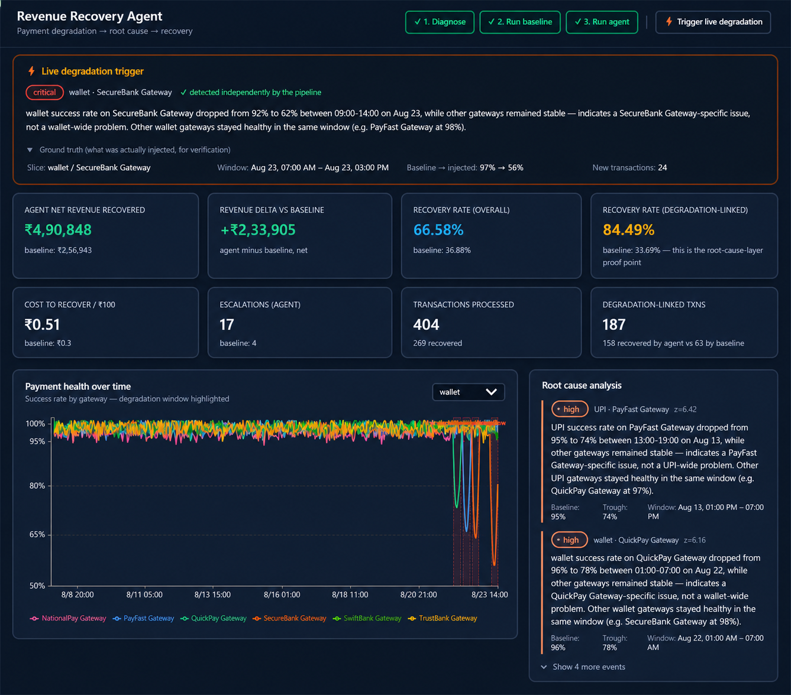
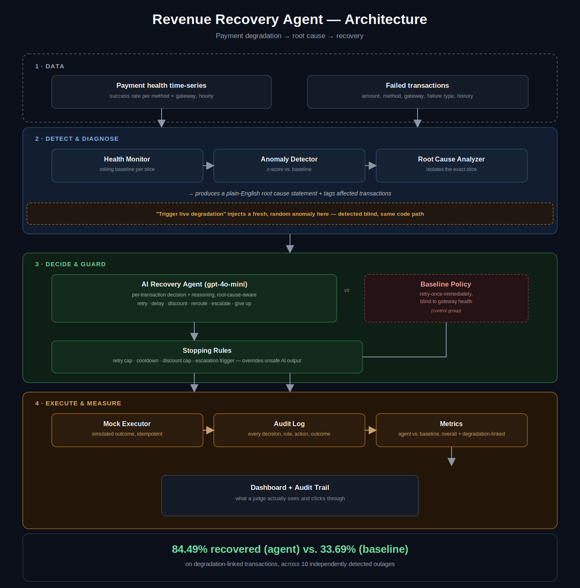

# Revenue Recovery Agent

[](https://github.com/SRIDEV20/revenue-recovery-agent/actions/workflows/ci.yml)

🔗 **[Live demo](https://revenue-recovery-agent-opal.vercel.app)** · 📄 [API docs](https://revenue-recovery-agent-3rmi.onrender.com/docs)

**An AI agent that doesn't just retry failed payments — it figures out *why* they're failing, system-wide, before deciding what to do about each one.**

Built for the **Razorpay AI Buildathon 2026 — AI Revenue Recovery track**
Direction: *Payment degradation → root cause → recovery*

> **Headline result:** on transactions caught inside a live payment outage, the agent recovers **84.49%** of revenue vs. **33.69%** for a naive retry-blind baseline — nearly **2.5x** — because it detects the outage and waits/reroutes instead of retrying straight into it. This holds across **ten independently detected degradation events**, nine of which were injected live and had never been seen by the pipeline before.



---

## The problem

When a specific payment gateway or method degrades — an outage, elevated declines, a latency spike — most recovery systems keep doing the same thing: retry, immediately, no matter what. That means retrying *into* a gateway that is still broken. Every retry burns an attempt, annoys the customer, and still fails, because the underlying cause hasn't gone anywhere.

Revenue gets lost twice: once to the outage itself, and again to a recovery strategy that has no idea the outage is happening.

## The approach

This system is a pipeline, not a single model call:



Full stage-by-stage detail: [`docs/architecture.md`](docs/architecture.md)

### Why the baseline comparison matters

The baseline policy is deliberately dumb: retry every failure exactly once, immediately, blind to gateway health. It exists so the headline number isn't "we recovered ₹X" (which proves nothing on its own) but **"we recovered X% more than the naive approach, and the gap is largest exactly where the root-cause layer should matter most — degradation-linked transactions."** That gap is the actual evidence the root-cause layer is doing real work, not just decoration on top of a generic recovery bot.

### Why this is hard to fake

The dataset ships with one scripted degradation event (a UPI/PayFast Gateway outage, Aug 13). To prove the detector generalizes rather than being reverse-engineered around that one scenario, the dashboard has a **"⚡ Trigger live degradation"** button that injects a *fresh, randomized* anomaly — different gateway, different payment method, different severity, different time window — and re-runs the full detect → diagnose → recover pipeline against it live.

The dashboard shows both sides so this is independently checkable:
- **Detected:** what the pipeline found, on its own, with no access to what was injected
- **Ground truth (collapsible):** what was actually injected, shown for the most recently triggered event

This was run ten times across the verified session behind these results — the original scripted event plus nine live-triggered ones, each on a different gateway, payment method, and time window:

| # | Slice | Window | Ground truth (injected) | Detected (blind) |
|---|---|---|---|---|
| 1 | UPI · PayFast Gateway | Aug 13, 13:00–19:00 | 95% → 74% (scripted) | 95% → 74% ✓ |
| 2 | wallet · QuickPay Gateway | Aug 22, ~01:00–07:00 | 97% → 73% | 96% → 78% ✓ |
| 3 | wallet · PayFast Gateway | Aug 22, 09:00–15:00 | — | 96% → 73% ✓ |
| 4 | wallet · SecureBank Gateway | Aug 22, 17:00–22:00 | — | 96% → 71% ✓ (critical) |
| 5 | netbanking · NationalPay Gateway | Aug 23, 00:00–05:00 | 94% → 75% | 93% → 79% ✓ |
| 6 | UPI · TrustBank Gateway | Aug 23, 08:00–12:00 | — | 95% → 79% ✓ |
| 7 | UPI · NationalPay Gateway | Aug 23, 14:00–19:00 | — | 95% → 71% ✓ |
| 8 | netbanking · SecureBank Gateway | Aug 23, 20:00–01:00 | — | 93% → 65% ✓ (critical) |
| 9 | wallet · NationalPay Gateway | Aug 24, 02:00–08:00 | 97% → 66% | 96% → 73% ✓ |
| 10 | wallet · SecureBank Gateway | Aug 23, 09:00–14:00 | 97% → 56% | 92% → 62% ✓ (critical) |

Each was found independently by the same detection code, on a different gateway/method/window every time — not a lookup tuned to one hardcoded case. The small deltas between injected and detected values (rows 2, 5, 9, and 10) are expected and are themselves evidence the detector is reading real rolling statistics from noisy data, not echoing a stored answer. Ground truth is only retained in the UI for the most recently triggered event; earlier events show "—" in that column even though they were verified independently at the time.

## Decision schema

Every agent decision follows a fixed, auditable shape:

```json
{
  "transaction_id": "txn_...",
  "decision": "retry_now | retry_delayed | send_discount | send_reminder | reroute_gateway | escalate | give_up",
  "reasoning": "one or two sentences, human-readable",
  "confidence": 0.0,
  "delay_hours": null,
  "discount_pct": null
}
```

The pipeline never trusts the model's echoed `transaction_id` — it's always overwritten with the source-of-truth ID before use, since LLMs are not reliable at exact character-for-character reproduction of opaque hex strings. This was found and fixed after a live batch run surfaced exactly this failure mode.

## Stopping rules & escalation

Explicit, enforced (not just documented) guardrails, because an agent that retries or discounts without limit isn't safe to point at real revenue:

- **Max 3 retry attempts** per transaction
- **Minimum 4-hour cooldown** between retries on the same transaction
- **Max 15% discount** depth
- **Auto-escalate to human review** when `retry_count_so_far >= 2` and `failure_type == bank_decline` — repeated bank declines are treated as a fraud-pattern risk rather than something to keep auto-retrying
- **Idempotency guard** — the executor checks the audit log for an existing outcome on a given `(transaction_id, policy)` pair before acting, so re-running a batch can't double-count recovered revenue
- **Batch-level fault isolation** — if any single transaction hits an unexpected error (malformed AI output, an unrecognized ID, an API failure), it's logged and skipped rather than crashing the rest of the batch

These were explicitly tested against deliberately invalid AI output (a 40% discount request, a 4th retry attempt, a repeated bank-decline retry) and confirmed to clip, convert, or block the action rather than execute it as-is. This is also covered by an automated pytest suite that runs in CI on every push (see the badge at the top of this README).

Every decision, rule check, action, and outcome is written to an append-only audit log, queryable via the API and exportable as JSON (`/api/audit-log/export`).

## Architecture / tech stack

| Layer | Tech |
|---|---|
| Backend | Python, FastAPI |
| Decision engine | OpenAI API, `gpt-4o-mini`, structured JSON output |
| Data processing | Pandas, NumPy (rolling stats / anomaly scoring) |
| Database | SQLite |
| Frontend | React, Vite, Tailwind CSS, Recharts |

Nothing here touches a real payment gateway or moves real money — every action (retry, discount, reminder, reroute) is simulated and logged, per the hackathon brief's guidance for prototypes. We generated a synthetic payment environment specifically to safely simulate degradation and evaluate recovery policies without using real customer or payment data.

### API surface (`/docs` for full interactive Swagger UI)

`GET /api/health` · `/api/health/timeseries` · `/api/health/slices` · `/api/health/events`
`POST /api/pipeline/diagnose` · `/api/pipeline/run/{policy}` · `/api/pipeline/inject-and-detect`
`GET /api/metrics` · `/api/decisions` · `/api/escalations` · `/api/audit-log` · `/api/audit-log/export`

## How to run locally

### Backend

```bash
cd backend
python -m venv venv
venv/Scripts/activate        # Windows; use `source venv/bin/activate` on macOS/Linux
pip install -r requirements.txt

cp ../.env.example .env      # then fill in OPENAI_API_KEY
python db.py                 # initializes the SQLite schema

# Generate the seed datasets
python data/generate_timeseries_dataset.py
python data/generate_transactions.py

uvicorn main:app --reload --port 8000
```

API docs: [https://revenue-recovery-agent-3rmi.onrender.com/docs](https://revenue-recovery-agent-3rmi.onrender.com/docs)

### Frontend

```bash
cd frontend
npm install
npm run dev
```

Dashboard: [https://revenue-recovery-agent-opal.vercel.app](https://revenue-recovery-agent-opal.vercel.app)

### Using the dashboard

1. **1. Diagnose** — detects the scripted degradation event and generates the root cause statement
2. **2. Run baseline** — runs the naive policy across all transactions (populates the small reference numbers on each metric card)
3. **3. Run agent** — runs the real AI decision engine across all transactions (makes live OpenAI calls, takes a couple of minutes; populates the primary headline numbers)
4. **⚡ Trigger live degradation** — injects a fresh, randomized anomaly and detects it independently; re-run steps 2 and 3 afterward to see the agent recover the newly affected transactions too

Dashboard state is persisted server-side, so refreshing the page reloads the last pipeline run rather than resetting to blank.

## Results

Numbers below are from the final verified run on the full dataset: 404 transactions, ten degradation events (one scripted, nine live-triggered).

| Metric | Agent | Baseline |
|---|---|---|
| Net revenue recovered | **₹4,90,848** | ₹2,56,943 |
| Revenue delta | **+₹2,33,905** | — |
| Recovery rate (overall) | **66.58%** | 36.88% |
| Recovery rate (degradation-linked only) | **84.49%** | 33.69% |
| Cost to recover / ₹100 | ₹0.51 | ₹0.30 |
| Escalations | 17 | 4 |
| Transactions processed | 404 (269 recovered) | 404 |
| Degradation-linked transactions | 158 recovered of 187 | 63 recovered of 187 |

The degradation-linked gap (84.49% vs. 33.69%) is the core proof point: the baseline keeps retrying blindly into each outage window and mostly fails; the agent detects the outage and waits it out or reroutes, recovering nearly 2.5x more of that same at-risk revenue. Cost-to-recover is higher for the agent because it spends on discounts and reroutes where the baseline spends nothing and simply gives up — but it converts that spend into far more of the outage-window revenue, a clear net win.

## Limitations & honest scope

- All data is synthetic; recovery outcomes are simulated against a `ground_truth_recovery_probability` assigned at dataset generation, not real payment gateway responses.
- Anomaly detection uses a rolling-baseline/z-score approach tuned for this dataset's noise level; a production system would need this validated against real traffic patterns.
- Actions (retry, discount, reminder, reroute) are mocked and logged, not wired to a real gateway, SMS/email provider, or payment processor.
- Outcome simulation currently draws from `ground_truth_recovery_probability` without a fixed random seed, so exact figures can drift between repeated runs on the same data — the direction and size of the agent-vs-baseline gap has stayed consistent (a wide, decisive margin in favor of the agent) across every run in testing.
- Duplicate transaction attempts are guarded against for the demo dataset via an audit-log check, not a production-grade idempotency system.

## What's next

- Now live-deployed on Render (backend) + Vercel (frontend) — see `backend/render.yaml` and `frontend/vercel.json` for the configs, useful for anyone redeploying their own copy.
- Fix the outcome simulation's random seed so repeated runs on identical data produce identical numbers, for fully reproducible demos.
- Real gateway/webhook integration to replace the synthetic transaction feed.
- A/B testing the agent against baseline on a live traffic split rather than a static synthetic batch.

---

*Razorpay AI Buildathon 2026 — AI Revenue Recovery Track*